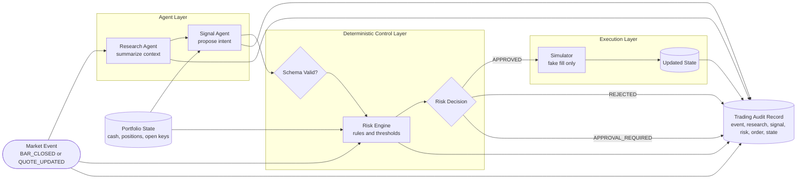
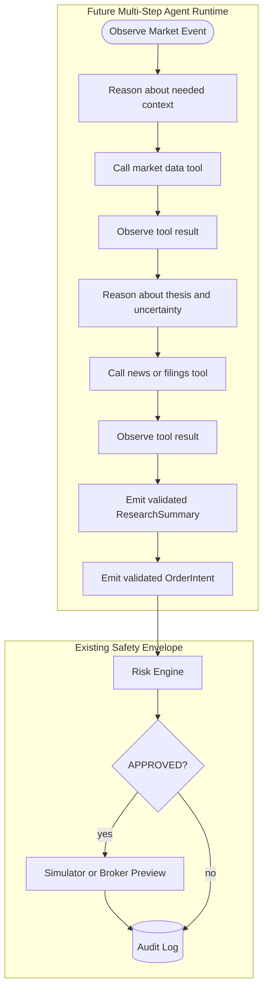

# Trading Loop Agent Architecture

This document describes the upper-level trading-agent loop implemented in the MVP branch and
where later multi-step agent reasoning fits.

## Current MVP Loop

The current loop is a guarded, single-pass agent workflow. It takes one market event, produces
structured research, proposes a candidate intent, applies deterministic risk controls, simulates
execution only when approved, updates portfolio state, and persists an audit record.



## Runtime Sequence

```mermaid
sequenceDiagram
    autonumber
    participant Source as Market/Event Source
    participant Loop as TradingLoopService
    participant Research as Research Agent
    participant Signal as Signal Agent
    participant Risk as Risk Engine
    participant Sim as Simulator
    participant Store as SQLite Audit Store

    Source->>Loop: MarketEvent + PortfolioState
    Loop->>Research: summarize(event)
    Research-->>Loop: ResearchSummary
    Loop->>Signal: create_intent(summary, state)
    Signal-->>Loop: OrderIntent
    Loop->>Risk: evaluate(intent, state, event)
    Risk-->>Loop: RiskDecision

    alt APPROVED
        Loop->>Sim: execute(intent, decision, event, state)
        Sim-->>Loop: SimulatedOrder + final state
    else REJECTED or APPROVAL_REQUIRED
        Loop->>Sim: no execution
    end

    Loop->>Store: save TradingAuditRecord
```

## What Makes It Agentic

The MVP separates agentic proposal from deterministic control:

- The Research Agent interprets the observed market event into structured context.
- The Signal Agent converts that context into a candidate `OrderIntent`.
- The Risk Engine decides whether the candidate can proceed.
- The Simulator performs the only action, and only after `APPROVED`.
- The Audit Record stores the full chain so every decision is explainable.

This already gives the project an agent-shaped workflow: observe, reason, propose, guard, act,
and record. The important safety boundary is that the agents do not execute trades directly.

## What It Is Not Yet

The current implementation is not a full ReAct loop yet. The agents are deterministic stubs, and
the loop does not yet perform iterative `Reason -> Act/tool call -> Observe -> Reason` cycles.

Current behavior:

```text
observe once -> summarize once -> propose once -> risk once -> simulate or stop
```

Future ReAct-style behavior:

```text
observe -> reason -> call tool -> observe result -> update reasoning -> call tool again
-> produce structured research -> produce candidate intent -> risk gate -> simulate or stop
```

## Later Roadmap: Multi-Step Reasoning

Multi-step agent reasoning should be implemented after the deterministic safety loop stays stable.
The recommended order is:

1. Keep the current deterministic loop as the safety envelope.
2. Add tool-call records to the audit log.
3. Add a Research Agent runtime that can call market, news, filings, and portfolio tools.
4. Add schema-constrained LLM output for `ResearchSummary`.
5. Add a Signal Agent runtime that consumes the validated summary and emits `OrderIntent`.
6. Keep risk validation, duplicate protection, stale-data checks, and kill switch outside the LLM.



## Design Rule

The ReAct loop can improve research quality and tool use, but it must not weaken control. The
LLM may decide what information to gather and what candidate to propose. The deterministic system
must decide whether anything is allowed to execute.
